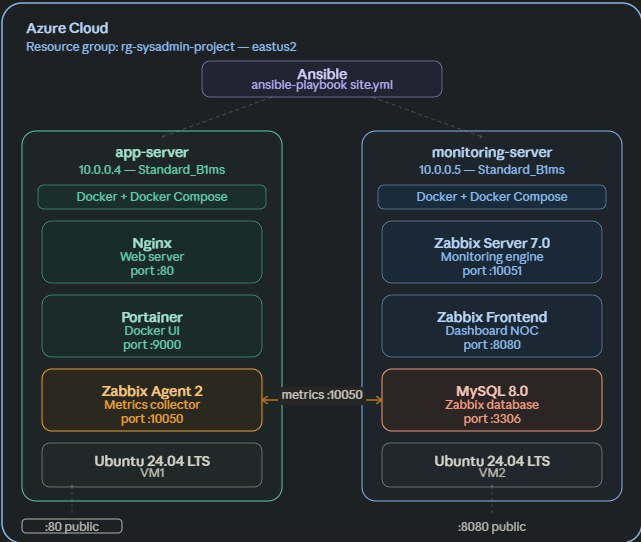

# Automated Infrastructure — Ansible + Docker + Zabbix on Azure


## Overview

End-to-end automated infrastructure deployment on Azure using Infrastructure as Code principles.
The entire stack is deployed with a single Ansible command — zero manual intervention.

## Architecture

## Tech Stack

| Tool | Role | Version |
|---|---|---|
| Ansible | Configuration management & automation | 2.x |
| Docker | Container runtime | Latest |
| Docker Compose | Multi-container orchestration | V2 |
| Zabbix | Infrastructure monitoring | 7.0 |
| MySQL | Zabbix database backend | 8.0 |
| Nginx | Web server (monitored service) | Latest |
| Azure | Cloud infrastructure | - |
| Ubuntu | OS on both VMs | 24.04 LTS |

## Project Structure
sysadmin-infra-project/

├── inventory/

│   └── hosts.ini          # Azure VMs inventory

├── roles/

│   ├── docker/            # Docker installation role

│   │   └── tasks/

│   │       └── main.yml

│   ├── app/               # Nginx + Portainer deployment

│   │   ├── tasks/

│   │   │   └── main.yml

│   │   └── files/

│   │       └── docker-compose.yml

│   ├── zabbix-server/     # Zabbix stack deployment

│   │   ├── tasks/

│   │   │   └── main.yml

│   │   └── files/

│   │       └── docker-compose.yml

│   └── zabbix-agent/      # Zabbix Agent 2 installation

│       └── tasks/

│           └── main.yml

├── site.yml               # Main playbook

└── README.md

## Quick Start

### Prerequisites
- Azure CLI installed and logged in
- Ansible installed (WSL/Linux)
- SSH key pair generated

### 1. Clone the repository
```bash
git clone https://github.com/ismail-hafiane/sysadmin-infra-project.git
cd sysadmin-infra-project
```

### 2. Update inventory with your VM IPs
```bash
nano inventory/hosts.ini
```

### 3. Deploy everything
```bash
ansible-playbook -i inventory/hosts.ini site.yml
```

That's it — the entire infrastructure deploys automatically.

## What Gets Deployed

### app-server (VM1)
- Docker + Docker Compose
- Nginx web server (port 80)
- Portainer Docker UI (port 9000)
- Zabbix Agent 2 (port 10050)

### monitoring-server (VM2)
- Docker + Docker Compose
- MySQL 8.0 (Zabbix database)
- Zabbix Server 7.0 (port 10051)
- Zabbix Frontend (port 8080)

## Monitoring

Access Zabbix dashboard at `http://<monitoring-server-ip>:8080`

Default credentials: `Admin` / `zabbix`

Monitored hosts:
- **app-server** — 70+ metrics, 15 graphs (CPU, RAM, network, disk)
- **Zabbix server** — self-monitored

## Key Learnings

- Ansible idempotency — running the playbook multiple times produces the same result
- Docker Compose healthchecks — solved MySQL race condition with `condition: service_healthy`
- Ansible roles — modular, reusable infrastructure components
- Azure CLI — infrastructure provisioning from command line

## Author

**Ismail Hafiane** — NOC Analyst → SysAdmin/DevOps Engineer

[](https://www.linkedin.com/in/ismailhafiane7/)
